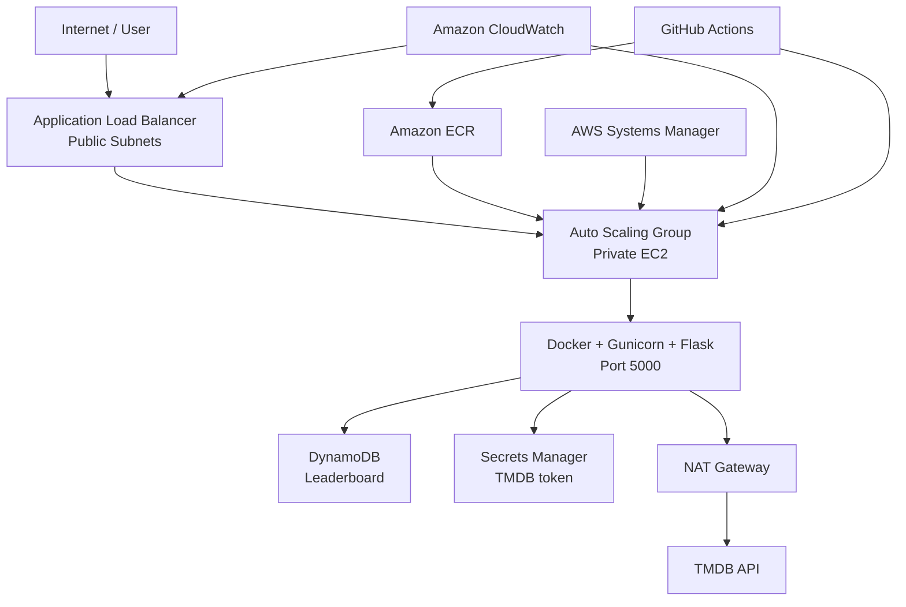

# CloudMovie Challenge

CloudMovie Challenge is an **AWS cloud-engineering capstone** built during the Ironhack Cloud Engineering Bootcamp. The application is intentionally simple - a Flask movie challenge - so the project can focus on infrastructure, security, automation, observability, resilience, and cost-aware architecture.

## What the project demonstrates

- Terraform-managed AWS infrastructure
- Multi-AZ VPC with public and private subnets
- Internet-facing Application Load Balancer
- Private EC2 instances managed by an Auto Scaling Group
- Docker + Gunicorn + Flask application runtime
- Amazon ECR container registry
- DynamoDB leaderboard persistence
- AWS Secrets Manager for the TMDB API token
- NAT Gateway for controlled outbound Internet access
- S3 Gateway VPC Endpoint for private S3 access
- AWS Systems Manager instead of SSH
- CloudWatch monitoring, logs, dashboard, and alarms
- GitHub Actions CI/CD with ECR publishing and ASG instance refresh
- Explicit cost and production trade-off documentation

## Architecture



### Request path

```text
Internet
   -> ALB
   -> private EC2 / Auto Scaling Group
   -> Docker / Gunicorn / Flask
```

### TMDB path

```text
Private EC2
   -> IAM role
   -> Secrets Manager (retrieve token)
   -> NAT Gateway
   -> Internet
   -> TMDB API
```

### Persistence path

```text
Flask application
   -> DynamoDB leaderboard
```

The EC2 layer is disposable. Leaderboard data survives instance replacement because persistent state is stored outside the compute instance.

---

## Design goals

The project was designed around five goals:

1. **Private compute** - application EC2 instances have no public IP addresses.
2. **Repeatability** - infrastructure is created through Terraform rather than manual console configuration.
3. **Operational visibility** - CloudWatch and ALB health checks expose application health.
4. **Automated delivery** - GitHub Actions builds and publishes application images and refreshes the ASG.
5. **Cost awareness** - the dev environment intentionally uses reduced capacity and can be destroyed when not required.

---

## Repository structure

```text
cloudmovie-challenge/
├── app/
│   ├── src/
│   │   ├── app.py
│   │   ├── movie_data.py
│   │   ├── services/
│   │   │   ├── leaderboard_service.py
│   │   │   ├── movie_service.py
│   │   │   └── secrets_service.py
│   │   ├── templates/
│   │   └── static/
│   ├── tests/
│   ├── Dockerfile
│   ├── requirements.txt
│   └── requirements-dev.txt
│
├── infrastructure/
│   ├── bootstrap/
│   ├── modules/
│   │   ├── networking/
│   │   ├── security/
│   │   ├── ecr/
│   │   ├── compute/
│   │   ├── alb/
│   │   ├── database/
│   │   ├── secrets/
│   │   └── monitoring/
│   └── environments/dev/
│
├── .github/workflows/
│   └── deploy.yml
│
├── docs/
│   ├── architecture.md
│   ├── decisions.md
│   ├── deployment.md
│   └── cost.md
│
├── scripts/
└── README.md
```

---

## Application

The application runs as a Docker container using:

- Python 3.12
- Flask
- Gunicorn
- boto3
- requests

Important endpoints:

| Endpoint | Purpose |
|---|---|
| `/` | Main CloudMovie application |
| `/game` | Movie challenge |
| `/leaderboard` | Persistent leaderboard |
| `/health` | ALB/container health check |
| `/api/movie-spotlight` | Live movie data from TMDB |

The Docker container exposes port `5000` and includes a container health check against `/health`.

---

## AWS architecture

### Networking

The VPC is deployed in `eu-central-1` and contains public and private subnets across multiple Availability Zones.

**Public tier**

- Application Load Balancer
- NAT Gateway
- Internet Gateway routing

**Private tier**

- EC2 instances in the Auto Scaling Group
- No public IP addresses

The application security group accepts port `5000` only from the ALB security group.

### Compute

Amazon Linux 2023 EC2 instances are launched from a Terraform-managed launch template.

The instances:

- use IMDSv2
- receive an IAM instance profile
- are administered through SSM
- install/start Docker through `user_data`
- authenticate to ECR
- pull the application image
- run the CloudMovie container

### Load balancing and self-healing

The ALB forwards HTTP traffic to the target group on port `5000` and checks `/health`.

The Auto Scaling Group maintains desired capacity and replaces failed or terminated instances. During testing, terminating an ASG instance caused AWS to launch a replacement and register it behind the ALB.

### Container registry

Amazon ECR repository:

```text
cloudmovie-challenge-dev
```

The EC2 role receives ECR pull permissions, while the GitHub Actions deployment identity can publish application images.

### DynamoDB

Leaderboard state is stored in:

```text
cloudmovie-challenge-dev-leaderboard
```

This separates persistent data from disposable compute.

### Secrets Manager + TMDB

Terraform creates the Secrets Manager secret container and the EC2 IAM permission required to read it.

The actual TMDB token is **not** inserted through Terraform, preventing the credential from being stored in Terraform state.

At runtime the application retrieves the token and sends it as a Bearer token when calling the TMDB API.

### NAT Gateway

The NAT Gateway has a real application requirement: the private EC2 instance needs outbound Internet access to call TMDB.

A single NAT Gateway is used in the development environment as a deliberate cost trade-off.

### S3 Gateway Endpoint

An S3 Gateway VPC Endpoint is associated with the private route table so S3 traffic does not need to traverse the NAT Gateway.

---

## Security

Implemented controls include:

- private EC2 instances
- no public EC2 IP addresses
- no SSH ingress
- SSM-based administration
- ALB-to-application security-group restriction
- IAM roles instead of AWS credentials on EC2
- Secrets Manager for the TMDB credential
- IMDSv2 required on the launch template
- least-privilege application permissions for DynamoDB and Secrets Manager
- Terraform-managed security configuration

For a production environment, GitHub OIDC would be preferred over long-lived CI access keys.

---

## Observability

The monitoring layer uses CloudWatch for operational visibility.

The project includes or is designed to expose:

- ALB target health
- application/instance logs
- CloudWatch dashboard
- CloudWatch alarms
- Auto Scaling health

The `/health` endpoint is used by both the container and ALB health-check flow.

---

## CI/CD

Workflow:

```text
Push application change to main
        -> GitHub Actions
        -> Build Docker image
        -> Authenticate to ECR
        -> Push image
        -> Start ASG instance refresh
        -> New EC2 instance launches
        -> user_data pulls the current image
        -> ALB waits for a healthy target
```

Workflow file:

```text
.github/workflows/deploy.yml
```

GitHub Actions credentials/settings currently required by the workflow include:

```text
AWS_ACCESS_KEY_ID
AWS_SECRET_ACCESS_KEY
ECR_URL
```

Do not commit these values to the repository.

---

## Terraform

### Environment root

Run Terraform from:

```bash
cd infrastructure/environments/dev
```

### Initialise

```bash
terraform init -reconfigure -backend-config=backend.hcl
```

### Validate

```bash
terraform fmt -recursive ../../
terraform validate
```

### Plan and apply

```bash
terraform plan -out=tfplan
terraform apply tfplan
```

### Useful outputs

```bash
terraform output
```

Common shell variables:

```bash
export ALB_DNS=$(terraform output -raw alb_dns_name)
export ASG_NAME=$(terraform output -raw autoscaling_group_name)
export TG_ARN=$(terraform output -raw target_group_arn)
export ECR_URL=$(terraform output -raw ecr_repository_url)
export SECRET_ARN=$(terraform output -raw tmdb_secret_arn)
```

---

## Store the TMDB token

Do not place the token in `terraform.tfvars` or commit it to Git.

```bash
read -s TMDB_TOKEN

printf '{"TMDB_API_TOKEN":"%s"}' \
  "$TMDB_TOKEN" \
  > /tmp/tmdb-secret.json

chmod 600 /tmp/tmdb-secret.json

aws secretsmanager put-secret-value \
  --secret-id "$SECRET_ARN" \
  --secret-string file:///tmp/tmdb-secret.json \
  --region eu-central-1

rm -f /tmp/tmdb-secret.json
unset TMDB_TOKEN
```

---

## Local development

Create/activate a Python virtual environment and install development dependencies.

```bash
pip install -r app/requirements-dev.txt
```

Run tests:

```bash
pytest app/tests -v
```

Run Flask from the repository root:

```bash
PYTHONPATH=app flask --app src.app:create_app run --debug
```

Or run Gunicorn from `app/`:

```bash
cd app
gunicorn --bind 0.0.0.0:5000 "src.app:create_app()"
```

---

## Docker

Build:

```bash
docker build -t cloudmovie-challenge:local ./app
```

Run:

```bash
docker run \
  --detach \
  --name cloudmovie-local \
  --publish 5000:5000 \
  cloudmovie-challenge:local
```

Test:

```bash
curl http://127.0.0.1:5000/health
```

---

## Validation

### Application health

```bash
curl "http://$ALB_DNS/health"
```

### TMDB integration

```bash
curl "http://$ALB_DNS/api/movie-spotlight"
```

### ALB target health

```bash
aws elbv2 describe-target-health \
  --target-group-arn "$TG_ARN" \
  --region eu-central-1 \
  --query 'TargetHealthDescriptions[*].{Instance:Target.Id,State:TargetHealth.State,Reason:TargetHealth.Reason}' \
  --output table
```

### Auto Scaling Group

```bash
aws autoscaling describe-auto-scaling-groups \
  --auto-scaling-group-names "$ASG_NAME" \
  --region eu-central-1 \
  --query 'AutoScalingGroups[0].Instances[*].{Instance:InstanceId,State:LifecycleState,Health:HealthStatus}' \
  --output table
```

### DynamoDB

```bash
aws dynamodb scan \
  --table-name cloudmovie-challenge-dev-leaderboard \
  --region eu-central-1
```

---

## Cost strategy

The environment intentionally prioritises **demonstrating architecture without running production-sized capacity**.

Current development trade-offs include:

- one desired EC2 instance
- maximum capacity of two for replacement/deployment
- one NAT Gateway
- HTTP ALB for the capstone demo
- small DynamoDB workload
- ephemeral dev environment

The major idle cost drivers are the NAT Gateway, ALB, and EC2 resources.

When the environment is no longer required, use Terraform to destroy it rather than manually deleting individual resources.

```bash
terraform plan -destroy -out=destroy.tfplan
terraform apply destroy.tfplan
```

See [docs/cost.md](docs/cost.md) for the full cost discussion.

---

## Deliberate trade-offs and production improvements

This is a capstone **development** architecture, not a claim that every setting is production-optimal.

For production I would add or change:

- HTTPS using ACM
- Route 53 custom domain
- minimum two application instances
- redundant NAT design or workload-specific endpoint strategy
- AWS WAF
- GitHub OIDC federation
- immutable/versioned image tags instead of relying only on `latest`
- stronger rollout/rollback controls
- separate dev/staging/prod Terraform environments
- more extensive monitoring and SLOs

---

## Documentation

- [Architecture](docs/architecture.md)
- [Architecture decisions](docs/decisions.md)
- [Deployment guide](docs/deployment.md)
- [Cost strategy](docs/cost.md)
- [Demo script](demo.md)

---

## Key learning outcomes

The strongest lesson from this project is that cloud engineering is not about adding the largest number of AWS services. It is about making each component serve a clear purpose.

Examples from CloudMovie Challenge:

- the ALB protects and decouples private compute
- the ASG provides self-healing and deployment replacement
- DynamoDB keeps state independent of EC2
- Secrets Manager removes credentials from source code
- the NAT Gateway exists because private compute genuinely needs an external API
- the S3 endpoint avoids unnecessary NAT traffic
- SSM removes the need for SSH
- CloudWatch makes the runtime observable
- GitHub Actions turns a code change into a repeatable deployment

That combination is the core cloud-engineering story of the project.
