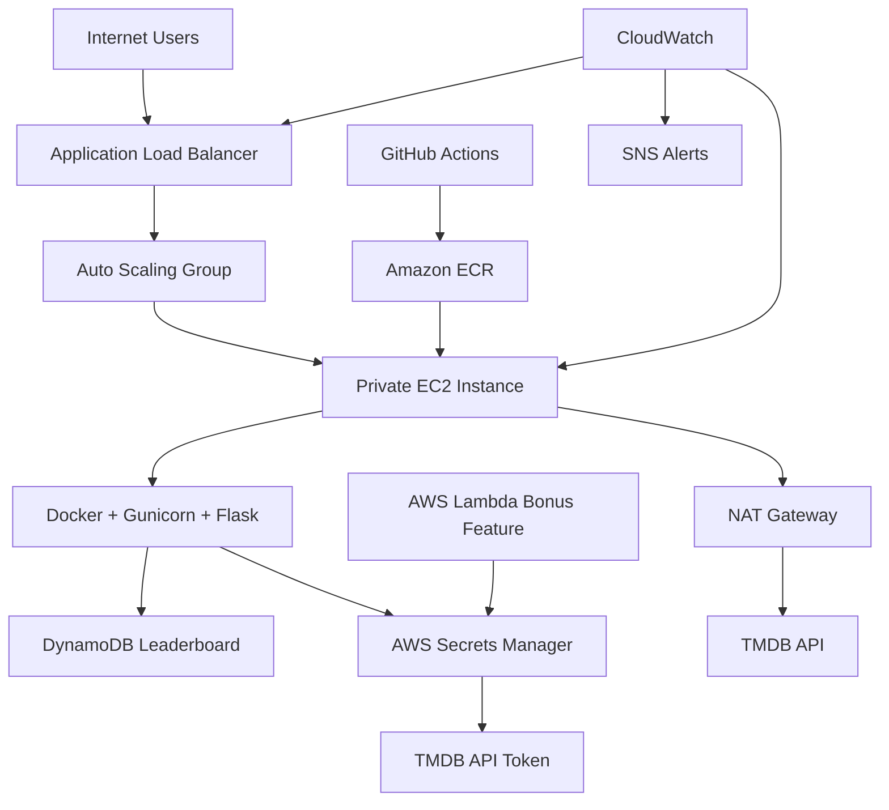

# 🎬 CloudMovie Challenge


CloudMovie Challenge is an **AWS Cloud Engineering Capstone Project** developed during the Ironhack Cloud Engineering Bootcamp.

The application itself is intentionally simple: users guess movies from emoji clues and compete through a leaderboard.

The main objective of this project is not the application complexity, but demonstrating a **production-style cloud architecture** including:

- Infrastructure as Code
- Secure AWS networking
- Container deployment
- CI/CD automation
- Monitoring and alerting
- Cloud cost awareness
- Infrastructure testing

---

# 📌 Project Overview

CloudMovie Challenge demonstrates how a traditional Flask application can be transformed into a cloud-native deployment.

The application runs inside Docker containers on AWS EC2 instances managed through an Auto Scaling Group.

The infrastructure is completely reproducible using Terraform.

The deployment workflow automatically:


Developer pushes code

	|

	↓

GitHub Actions

	|

	↓

Docker image build

	|

	↓

Amazon ECR

	|

	↓

EC2 Auto Scaling refresh

	|

	↓

Application deployed behind ALB


---

# 🏗️ High-Level Architecture



---


# 🚀 Application Features

## Movie Challenge

Users can:

* View emoji movie clues
* Select answers
* Receive instant feedback
* Compete on leaderboard

## Leaderboard

Implemented using:

* Amazon DynamoDB
* Persistent storage independent from EC2

## Movie Data

Movie information is retrieved dynamically using:

* TMDB API
* AWS Secrets Manager

## Health Monitoring

Application endpoint:

<pre class="overflow-visible! px-0!" data-start="3135" data-end="3154"><div class="relative w-full mt-4 mb-1"><div class=""><div class="contents"><div class="relative"><div class="h-full min-h-0 min-w-0"><div class="h-full min-h-0 min-w-0"><div class="border border-token-border-light border-radius-3xl corner-superellipse/1.1 rounded-3xl"><div class="h-full w-full border-radius-3xl bg-(--code-block-surface) corner-superellipse/1.1 overflow-clip rounded-3xl [--code-block-surface:var(--bg-elevated-secondary)] dark:[--code-block-surface:var(--composer-surface-primary)] lxnfua_clipPathFallback"><div class="pointer-events-none absolute end-1.5 top-1 z-2 md:end-2 md:top-1"></div><div class="relative"><div class="pe-11 pt-3"><div class="relative z-0 flex max-w-full"><div id="code-block-viewer" dir="ltr" class="q9tKkq_viewer cm-editor z-10 light:cm-light dark:cm-light flex h-full w-full flex-col items-stretch ͼd ͼr"><div class="cm-scroller"><pre class="cm-content q9tKkq_readonly m-0"><code><span>GET /health</span></code></pre></div></div></div></div></div></div></div></div></div><div class=""><div class=""></div></div></div></div></div></div></pre>

Used by:

* Docker health check
* ALB target health checks
* Monitoring validation

---


# ☁️ AWS Services Used

| AWS Service               | Purpose                          |
| ------------------------- | -------------------------------- |
| VPC                       | Secure networking foundation     |
| EC2                       | Application compute              |
| Auto Scaling Group        | Self-healing infrastructure      |
| Application Load Balancer | Traffic distribution             |
| ECR                       | Docker image registry            |
| DynamoDB                  | Leaderboard database             |
| Secrets Manager           | Secure API credentials           |
| Lambda                    | Bonus serverless feature         |
| CloudWatch                | Monitoring and dashboards        |
| SNS                       | Alarm notifications              |
| Systems Manager           | SSH-less administration          |
| NAT Gateway               | Private outbound internet access |
| S3 Gateway Endpoint       | Private AWS service connectivity |


---


# 🌐 Request Flow

## User Request

<pre class="overflow-visible! px-0!" data-start="3902" data-end="4016"><div class="relative w-full mt-4 mb-1"><div class=""><div class="contents"><div class="relative"><div class="h-full min-h-0 min-w-0"><div class="h-full min-h-0 min-w-0"><div class="border border-token-border-light border-radius-3xl corner-superellipse/1.1 rounded-3xl"><div class="h-full w-full border-radius-3xl bg-(--code-block-surface) corner-superellipse/1.1 overflow-clip rounded-3xl [--code-block-surface:var(--bg-elevated-secondary)] dark:[--code-block-surface:var(--composer-surface-primary)] lxnfua_clipPathFallback"><div class="pointer-events-none absolute end-1.5 top-1 z-2 md:end-2 md:top-1"></div><div class="relative"><div class="pe-11 pt-3"><div class="relative z-0 flex max-w-full"><div id="code-block-viewer" dir="ltr" class="q9tKkq_viewer cm-editor z-10 light:cm-light dark:cm-light flex h-full w-full flex-col items-stretch ͼd ͼr"><div class="cm-scroller"><pre class="cm-content q9tKkq_readonly m-0"><code><span>Internet

↓

Application Load Balancer

↓

Private EC2 Instance

↓

Docker Container

↓

Flask Application</span></code></pre></div></div></div></div></div></div></div></div></div><div class=""><div class=""></div></div></div></div></div></div></pre>

## Movie API Request

<pre class="overflow-visible! px-0!" data-start="4041" data-end="4147"><div class="relative w-full mt-4 mb-1"><div class=""><div class="contents"><div class="relative"><div class="h-full min-h-0 min-w-0"><div class="h-full min-h-0 min-w-0"><div class="border border-token-border-light border-radius-3xl corner-superellipse/1.1 rounded-3xl"><div class="h-full w-full border-radius-3xl bg-(--code-block-surface) corner-superellipse/1.1 overflow-clip rounded-3xl [--code-block-surface:var(--bg-elevated-secondary)] dark:[--code-block-surface:var(--composer-surface-primary)] lxnfua_clipPathFallback"><div class="pointer-events-none absolute end-1.5 top-1 z-2 md:end-2 md:top-1"></div><div class="relative"><div class="pe-11 pt-3"><div class="relative z-0 flex max-w-full"><div id="code-block-viewer" dir="ltr" class="q9tKkq_viewer cm-editor z-10 light:cm-light dark:cm-light flex h-full w-full flex-col items-stretch ͼd ͼr"><div class="cm-scroller"><pre class="cm-content q9tKkq_readonly m-0"><code><span>Flask Application

↓

IAM Role

↓

Secrets Manager

↓

TMDB API Token

↓

NAT Gateway

↓

TMDB API</span></code></pre></div></div></div></div></div></div></div></div></div><div class=""><div class=""></div></div></div></div></div></div></pre>

## Leaderboard Flow

<pre class="overflow-visible! px-0!" data-start="4171" data-end="4241"><div class="relative w-full mt-4 mb-1"><div class=""><div class="contents"><div class="relative"><div class="h-full min-h-0 min-w-0"><div class="h-full min-h-0 min-w-0"><div class="border border-token-border-light border-radius-3xl corner-superellipse/1.1 rounded-3xl"><div class="h-full w-full border-radius-3xl bg-(--code-block-surface) corner-superellipse/1.1 overflow-clip rounded-3xl [--code-block-surface:var(--bg-elevated-secondary)] dark:[--code-block-surface:var(--composer-surface-primary)] lxnfua_clipPathFallback"><div class="pointer-events-none absolute end-1.5 top-1 z-2 md:end-2 md:top-1"></div><div class="relative"><div class="pe-11 pt-3"><div class="relative z-0 flex max-w-full"><div id="code-block-viewer" dir="ltr" class="q9tKkq_viewer cm-editor z-10 light:cm-light dark:cm-light flex h-full w-full flex-col items-stretch ͼd ͼr"><div class="cm-scroller"><pre class="cm-content q9tKkq_readonly m-0"><code><span>Flask Application

↓

DynamoDB

↓

Persistent Leaderboard Data</span></code></pre></div></div></div></div></div></div></div></div></div><div class=""><div class=""></div></div></div></div></div></div></pre>

---

# 🏛 Infrastructure Design

## Networking

The infrastructure uses:

* Custom VPC
* Multi Availability Zone deployment
* Public subnets
* Private subnets
* Internet Gateway
* NAT Gateway
* S3 Gateway Endpoint

Architecture decision:

The application servers remain private while only the ALB is exposed publicly.


---


# 🖥 Compute Layer

Application servers:

* Amazon Linux 2023
* Docker runtime
* Gunicorn WSGI server
* Flask application

Features:

* IMDSv2 enabled
* IAM instance profile
* SSM management
* Automated image pull from ECR


---


# 🔐 Security Implementation

Implemented security practices:

✅ Private EC2 instances

✅ No public SSH access

✅ AWS Systems Manager instead of SSH

✅ IAM roles instead of access keys

✅ Secrets Manager for sensitive values

✅ Security group least privilege

✅ IMDSv2 enabled

✅ Terraform-managed permissions

Production improvements:

* GitHub OIDC authentication
* AWS WAF
* HTTPS with ACM certificates
* Route53 domain
* Advanced IAM policies

---


# 🏗 Infrastructure as Code

Terraform manages:

<pre class="overflow-visible! px-0!" data-start="5309" data-end="5449"><div class="relative w-full mt-4 mb-1"><div class=""><div class="contents"><div class="relative"><div class="h-full min-h-0 min-w-0"><div class="h-full min-h-0 min-w-0"><div class="border border-token-border-light border-radius-3xl corner-superellipse/1.1 rounded-3xl"><div class="h-full w-full border-radius-3xl bg-(--code-block-surface) corner-superellipse/1.1 overflow-clip rounded-3xl [--code-block-surface:var(--bg-elevated-secondary)] dark:[--code-block-surface:var(--composer-surface-primary)] lxnfua_clipPathFallback"><div class="pointer-events-none absolute end-1.5 top-1 z-2 md:end-2 md:top-1"></div><div class="relative"><div class="pe-11 pt-3"><div class="relative z-0 flex max-w-full"><div id="code-block-viewer" dir="ltr" class="q9tKkq_viewer cm-editor z-10 light:cm-light dark:cm-light flex h-full w-full flex-col items-stretch ͼd ͼr"><div class="cm-scroller"><pre class="cm-content q9tKkq_readonly m-0"><code><span>infrastructure/

├── networking

├── security

├── compute

├── alb

├── ecr

├── database

├── secrets

├── monitoring

└── lambda
</span></code></pre></div></div></div></div></div></div></div></div></div><div class=""><div class=""></div></div></div></div></div></div></pre>

Terraform workflow:

Initialize:

<pre class="overflow-visible! px-0!" data-start="5487" data-end="5556"><div class="relative w-full mt-4 mb-1"><div class=""><div class="contents"><div class="border border-token-border-light border-radius-3xl corner-superellipse/1.1 rounded-3xl"><div class="relative h-full w-full border-radius-3xl bg-(--code-block-surface) corner-superellipse/1.1 overflow-clip rounded-3xl [--code-block-surface:var(--bg-elevated-secondary)] dark:[--code-block-surface:var(--composer-surface-primary)] lxnfua_clipPathFallback"><div class="pointer-events-none absolute inset-x-4 top-12 bottom-4"><div class="pointer-events-none sticky z-40 shrink-0 z-1!"><div class="sticky bg-token-border-light"></div></div></div><div class="relative"><div class="h-full min-h-0 min-w-0"><div class="h-full min-h-0 min-w-0"><div class=""><div class="relative"><div class=""><div class="relative z-0 flex max-w-full"><div id="code-block-viewer" dir="ltr" class="q9tKkq_viewer cm-editor z-10 light:cm-light dark:cm-light flex h-full w-full flex-col items-stretch ͼd ͼr"><div class="cm-scroller"><pre class="cm-content q9tKkq_readonly m-0"><code><span>terraform init </span><span class="ͼn">-reconfigure</span><span> \
</span><span class="ͼn">-backend-config</span><span class="ͼg">=</span><span>backend.hcl</span></code></pre></div></div></div></div></div></div></div></div><div class=""><div class=""></div></div></div></div></div></div></div></div></pre>

Format:

<pre class="overflow-visible! px-0!" data-start="5568" data-end="5611"><div class="relative w-full mt-4 mb-1"><div class=""><div class="contents"><div class="border border-token-border-light border-radius-3xl corner-superellipse/1.1 rounded-3xl"><div class="relative h-full w-full border-radius-3xl bg-(--code-block-surface) corner-superellipse/1.1 overflow-clip rounded-3xl [--code-block-surface:var(--bg-elevated-secondary)] dark:[--code-block-surface:var(--composer-surface-primary)] lxnfua_clipPathFallback"><div class="pointer-events-none absolute inset-x-4 top-12 bottom-4"><div class="pointer-events-none sticky z-40 shrink-0 z-1!"><div class="sticky bg-token-border-light"></div></div></div><div class="relative"><div class="h-full min-h-0 min-w-0"><div class="h-full min-h-0 min-w-0"><div class=""><div class="relative"><div class=""><div class="relative z-0 flex max-w-full"><div id="code-block-viewer" dir="ltr" class="q9tKkq_viewer cm-editor z-10 light:cm-light dark:cm-light flex h-full w-full flex-col items-stretch ͼd ͼr"><div class="cm-scroller"><pre class="cm-content q9tKkq_readonly m-0"><code><span>terraform fmt </span><span class="ͼn">-recursive</span><span> ../../</span></code></pre></div></div></div></div></div></div></div></div><div class=""><div class=""></div></div></div></div></div></div></div></div></pre>

Validate:

<pre class="overflow-visible! px-0!" data-start="5625" data-end="5655"><div class="relative w-full mt-4 mb-1"><div class=""><div class="contents"><div class="border border-token-border-light border-radius-3xl corner-superellipse/1.1 rounded-3xl"><div class="relative h-full w-full border-radius-3xl bg-(--code-block-surface) corner-superellipse/1.1 overflow-clip rounded-3xl [--code-block-surface:var(--bg-elevated-secondary)] dark:[--code-block-surface:var(--composer-surface-primary)] lxnfua_clipPathFallback"><div class="pointer-events-none absolute inset-x-4 top-12 bottom-4"><div class="pointer-events-none sticky z-40 shrink-0 z-1!"><div class="sticky bg-token-border-light"></div></div></div><div class="relative"><div class="h-full min-h-0 min-w-0"><div class="h-full min-h-0 min-w-0"><div class=""><div class="relative"><div class=""><div class="relative z-0 flex max-w-full"><div id="code-block-viewer" dir="ltr" class="q9tKkq_viewer cm-editor z-10 light:cm-light dark:cm-light flex h-full w-full flex-col items-stretch ͼd ͼr"><div class="cm-scroller"><pre class="cm-content q9tKkq_readonly m-0"><code><span>terraform validate</span></code></pre></div></div></div></div></div></div></div></div><div class=""><div class=""></div></div></div></div></div></div></div></div></pre>

Plan:

<pre class="overflow-visible! px-0!" data-start="5665" data-end="5703"><div class="relative w-full mt-4 mb-1"><div class=""><div class="contents"><div class="border border-token-border-light border-radius-3xl corner-superellipse/1.1 rounded-3xl"><div class="relative h-full w-full border-radius-3xl bg-(--code-block-surface) corner-superellipse/1.1 overflow-clip rounded-3xl [--code-block-surface:var(--bg-elevated-secondary)] dark:[--code-block-surface:var(--composer-surface-primary)] lxnfua_clipPathFallback"><div class="pointer-events-none absolute inset-x-4 top-12 bottom-4"><div class="pointer-events-none sticky z-40 shrink-0 z-1!"><div class="sticky bg-token-border-light"></div></div></div><div class="relative"><div class="h-full min-h-0 min-w-0"><div class="h-full min-h-0 min-w-0"><div class=""><div class="relative"><div class=""><div class="relative z-0 flex max-w-full"><div id="code-block-viewer" dir="ltr" class="q9tKkq_viewer cm-editor z-10 light:cm-light dark:cm-light flex h-full w-full flex-col items-stretch ͼd ͼr"><div class="cm-scroller"><pre class="cm-content q9tKkq_readonly m-0"><code><span>terraform plan </span><span class="ͼn">-out</span><span class="ͼg">=</span><span>tfplan</span></code></pre></div></div></div></div></div></div></div></div><div class=""><div class=""></div></div></div></div></div></div></div></div></pre>

Deploy:

<pre class="overflow-visible! px-0!" data-start="5715" data-end="5749"><div class="relative w-full mt-4 mb-1"><div class=""><div class="contents"><div class="border border-token-border-light border-radius-3xl corner-superellipse/1.1 rounded-3xl"><div class="relative h-full w-full border-radius-3xl bg-(--code-block-surface) corner-superellipse/1.1 overflow-clip rounded-3xl [--code-block-surface:var(--bg-elevated-secondary)] dark:[--code-block-surface:var(--composer-surface-primary)] lxnfua_clipPathFallback"><div class="pointer-events-none absolute inset-x-4 top-12 bottom-4"><div class="pointer-events-none sticky z-40 shrink-0 z-1!"><div class="sticky bg-token-border-light"></div></div></div><div class="relative"><div class="h-full min-h-0 min-w-0"><div class="h-full min-h-0 min-w-0"><div class=""><div class="relative"><div class=""><div class="relative z-0 flex max-w-full"><div id="code-block-viewer" dir="ltr" class="q9tKkq_viewer cm-editor z-10 light:cm-light dark:cm-light flex h-full w-full flex-col items-stretch ͼd ͼr"><div class="cm-scroller"><pre class="cm-content q9tKkq_readonly m-0"><code><span>terraform apply tfplan</span></code></pre></div></div></div></div></div></div></div></div><div class=""><div class=""></div></div></div></div></div></div></div></div></pre>


---


# 🔄 CI/CD Pipeline

GitHub Actions automatically handles:

<pre class="overflow-visible! px-0!" data-start="5819" data-end="5991"><div class="relative w-full mt-4 mb-1"><div class=""><div class="contents"><div class="relative"><div class="h-full min-h-0 min-w-0"><div class="h-full min-h-0 min-w-0"><div class="border border-token-border-light border-radius-3xl corner-superellipse/1.1 rounded-3xl"><div class="h-full w-full border-radius-3xl bg-(--code-block-surface) corner-superellipse/1.1 overflow-clip rounded-3xl [--code-block-surface:var(--bg-elevated-secondary)] dark:[--code-block-surface:var(--composer-surface-primary)] lxnfua_clipPathFallback"><div class="pointer-events-none absolute end-1.5 top-1 z-2 md:end-2 md:top-1"></div><div class="relative"><div class="pe-11 pt-3"><div class="relative z-0 flex max-w-full"><div id="code-block-viewer" dir="ltr" class="q9tKkq_viewer cm-editor z-10 light:cm-light dark:cm-light flex h-full w-full flex-col items-stretch ͼd ͼr"><div class="cm-scroller"><pre class="cm-content q9tKkq_readonly m-0"><code><span>Git Push

↓

Run Tests

↓

Build Docker Image

↓

Login to ECR

↓

Push Image

↓

Trigger ASG Instance Refresh

↓

Application Replacement

↓

ALB Health Validation</span></code></pre></div></div></div></div></div></div></div></div></div><div class=""><div class=""></div></div></div></div></div></div></pre>

Workflow files:

<pre class="overflow-visible! px-0!" data-start="6011" data-end="6071"><div class="relative w-full mt-4 mb-1"><div class=""><div class="contents"><div class="relative"><div class="h-full min-h-0 min-w-0"><div class="h-full min-h-0 min-w-0"><div class="border border-token-border-light border-radius-3xl corner-superellipse/1.1 rounded-3xl"><div class="h-full w-full border-radius-3xl bg-(--code-block-surface) corner-superellipse/1.1 overflow-clip rounded-3xl [--code-block-surface:var(--bg-elevated-secondary)] dark:[--code-block-surface:var(--composer-surface-primary)] lxnfua_clipPathFallback"><div class="pointer-events-none absolute end-1.5 top-1 z-2 md:end-2 md:top-1"></div><div class="relative"><div class="pe-11 pt-3"><div class="relative z-0 flex max-w-full"><div id="code-block-viewer" dir="ltr" class="q9tKkq_viewer cm-editor z-10 light:cm-light dark:cm-light flex h-full w-full flex-col items-stretch ͼd ͼr"><div class="cm-scroller"><pre class="cm-content q9tKkq_readonly m-0"><code><span>.github/workflows/

├── infra-ci.yml

└── deploy.yml</span></code></pre></div></div></div></div></div></div></div></div></div></div></div></div></div></pre>


---


# 📊 Monitoring & Observability

The project implements CloudWatch monitoring for:

## Operations Dashboard

Dashboard contains:

* ALB request metrics
* Target health
* HTTP errors
* EC2 monitoring
* DynamoDB usage
* Application logs

Example:

<pre class="overflow-visible! px-0!" data-start="6330" data-end="6450"><div class="relative w-full mt-4 mb-1"><div class=""><div class="contents"><div class="relative"><div class="h-full min-h-0 min-w-0"><div class="h-full min-h-0 min-w-0"><div class="border border-token-border-light border-radius-3xl corner-superellipse/1.1 rounded-3xl"><div class="h-full w-full border-radius-3xl bg-(--code-block-surface) corner-superellipse/1.1 overflow-clip rounded-3xl [--code-block-surface:var(--bg-elevated-secondary)] dark:[--code-block-surface:var(--composer-surface-primary)] lxnfua_clipPathFallback"><div class="pointer-events-none absolute end-1.5 top-1 z-2 md:end-2 md:top-1"></div><div class="relative"><div class="pe-11 pt-3"><div class="relative z-0 flex max-w-full"><div id="code-block-viewer" dir="ltr" class="q9tKkq_viewer cm-editor z-10 light:cm-light dark:cm-light flex h-full w-full flex-col items-stretch ͼd ͼr"><div class="cm-scroller"><pre class="cm-content q9tKkq_readonly m-0"><code><span>CloudMovie Challenge

        FinOps & Operations Dashboard

Requests
Healthy Targets
Errors
Resource Usage
Logs</span></code></pre></div></div></div></div></div></div></div></div></div><div class=""><div class=""></div></div></div></div></div></div></pre>


---


# 🔎 Logs Insights

CloudWatch Logs Insights allows debugging:

Example query:

<pre class="overflow-visible! px-0!" data-start="6541" data-end="6656"><div class="relative w-full mt-4 mb-1"><div class=""><div class="contents"><div class="border border-token-border-light border-radius-3xl corner-superellipse/1.1 rounded-3xl"><div class="relative h-full w-full border-radius-3xl bg-(--code-block-surface) corner-superellipse/1.1 overflow-clip rounded-3xl [--code-block-surface:var(--bg-elevated-secondary)] dark:[--code-block-surface:var(--composer-surface-primary)] lxnfua_clipPathFallback"><div class="pointer-events-none absolute inset-x-4 top-12 bottom-4"><div class="pointer-events-none sticky z-40 shrink-0 z-1!"><div class="sticky bg-token-border-light"></div></div></div><div class="relative"><div class="h-full min-h-0 min-w-0"><div class="h-full min-h-0 min-w-0"><div class=""><div class="relative"><div class=""><div class="relative z-0 flex max-w-full"><div id="code-block-viewer" dir="ltr" class="q9tKkq_viewer cm-editor z-10 light:cm-light dark:cm-light flex h-full w-full flex-col items-stretch ͼd ͼr"><div class="cm-scroller"><pre class="cm-content q9tKkq_readonly m-0"><code><span>fields @</span><span class="ͼm">timestamp</span><span>,@message

</span><span class="ͼg">|</span><span> filter @message </span><span class="ͼg">like</span><span></span><span class="ͼg">/</span><span>ERROR</span><span class="ͼg">|Exception/</span><span>

</span><span class="ͼg">|</span><span> sort @</span><span class="ͼm">timestamp</span><span></span><span class="ͼg">desc</span><span>

</span><span class="ͼg">|</span><span></span><span class="ͼg">limit</span><span></span><span class="ͼj">20</span></code></pre></div></div></div></div></div></div></div></div></div></div></div></div></div></div></pre>

---


# 🚨 Alerting

Implemented alarms:

* ALB 5xx errors
* Unhealthy targets

Alert flow:

<pre class="overflow-visible! px-0!" data-start="6753" data-end="6814"><div class="relative w-full mt-4 mb-1"><div class=""><div class="contents"><div class="relative"><div class="h-full min-h-0 min-w-0"><div class="h-full min-h-0 min-w-0"><div class="border border-token-border-light border-radius-3xl corner-superellipse/1.1 rounded-3xl"><div class="h-full w-full border-radius-3xl bg-(--code-block-surface) corner-superellipse/1.1 overflow-clip rounded-3xl [--code-block-surface:var(--bg-elevated-secondary)] dark:[--code-block-surface:var(--composer-surface-primary)] lxnfua_clipPathFallback"><div class="pointer-events-none absolute end-1.5 top-1 z-2 md:end-2 md:top-1"></div><div class="relative"><div class="pe-11 pt-3"><div class="relative z-0 flex max-w-full"><div id="code-block-viewer" dir="ltr" class="q9tKkq_viewer cm-editor z-10 light:cm-light dark:cm-light flex h-full w-full flex-col items-stretch ͼd ͼr"><div class="cm-scroller"><pre class="cm-content q9tKkq_readonly m-0"><code><span>CloudWatch Alarm

↓

SNS Topic

↓

Email Notification</span></code></pre></div></div></div></div></div></div></div></div></div></div></div></div></div></pre>

---


# ⚡ Lambda Bonus Feature

A lightweight Lambda function was added as an optional serverless component.

Purpose:

* Demonstrate AWS Lambda integration
* Show event-driven architecture capability
* Keep resource usage within free-tier limits

Configuration:

* Runtime: Python 3.12
* Architecture: ARM64
* Memory: 128 MB

---


# 💰 Cost Optimization / FinOps

The project intentionally balances production concepts with AWS free-tier awareness.

Cost decisions:

| Resource        | Decision                             |
| --------------- | ------------------------------------ |
| EC2             | Single instance development capacity |
| NAT Gateway     | Single NAT instead of multi-AZ       |
| DynamoDB        | On-demand mode                       |
| Lambda          | Minimal memory allocation            |
| CloudWatch Logs | Short retention                      |
| ALB             | Used for architecture demonstration  |

Major cost contributors:

* NAT Gateway
* Application Load Balancer
* EC2

Resources can be removed after demonstration:

<pre class="overflow-visible! px-0!" data-start="7695" data-end="7762"><div class="relative w-full mt-4 mb-1"><div class=""><div class="contents"><div class="border border-token-border-light border-radius-3xl corner-superellipse/1.1 rounded-3xl"><div class="relative h-full w-full border-radius-3xl bg-(--code-block-surface) corner-superellipse/1.1 overflow-clip rounded-3xl [--code-block-surface:var(--bg-elevated-secondary)] dark:[--code-block-surface:var(--composer-surface-primary)] lxnfua_clipPathFallback"><div class="pointer-events-none absolute inset-x-4 top-12 bottom-4"><div class="pointer-events-none sticky z-40 shrink-0 z-1!"><div class="sticky bg-token-border-light"></div></div></div><div class="relative"><div class="h-full min-h-0 min-w-0"><div class="h-full min-h-0 min-w-0"><div class=""><div class="relative"><div class=""><div class="relative z-0 flex max-w-full"><div id="code-block-viewer" dir="ltr" class="q9tKkq_viewer cm-editor z-10 light:cm-light dark:cm-light flex h-full w-full flex-col items-stretch ͼd ͼr"><div class="cm-scroller"><pre class="cm-content q9tKkq_readonly m-0"><code><span>terraform plan </span><span class="ͼn">-destroy</span><span>

terraform apply destroy.tfplan</span></code></pre></div></div></div></div></div></div></div></div></div></div></div></div></div></div></pre>

---


# 🧪 Testing

## Application Testing

Framework:

<pre class="overflow-visible! px-0!" data-start="7822" data-end="7836"><div class="relative w-full mt-4 mb-1"><div class=""><div class="contents"><div class="relative"><div class="h-full min-h-0 min-w-0"><div class="h-full min-h-0 min-w-0"><div class="border border-token-border-light border-radius-3xl corner-superellipse/1.1 rounded-3xl"><div class="h-full w-full border-radius-3xl bg-(--code-block-surface) corner-superellipse/1.1 overflow-clip rounded-3xl [--code-block-surface:var(--bg-elevated-secondary)] dark:[--code-block-surface:var(--composer-surface-primary)] lxnfua_clipPathFallback"><div class="pointer-events-none absolute end-1.5 top-1 z-2 md:end-2 md:top-1"></div><div class="relative"><div class="pe-11 pt-3"><div class="relative z-0 flex max-w-full"><div id="code-block-viewer" dir="ltr" class="q9tKkq_viewer cm-editor z-10 light:cm-light dark:cm-light flex h-full w-full flex-col items-stretch ͼd ͼr"><div class="cm-scroller"><pre class="cm-content q9tKkq_readonly m-0"><code><span>pytest</span></code></pre></div></div></div></div></div></div></div></div></div><div class=""><div class=""></div></div></div></div></div></div></pre>

Run:

<pre class="overflow-visible! px-0!" data-start="7846" data-end="7877"><div class="relative w-full mt-4 mb-1"><div class=""><div class="contents"><div class="border border-token-border-light border-radius-3xl corner-superellipse/1.1 rounded-3xl"><div class="relative h-full w-full border-radius-3xl bg-(--code-block-surface) corner-superellipse/1.1 overflow-clip rounded-3xl [--code-block-surface:var(--bg-elevated-secondary)] dark:[--code-block-surface:var(--composer-surface-primary)] lxnfua_clipPathFallback"><div class="pointer-events-none absolute inset-x-4 top-12 bottom-4"><div class="pointer-events-none sticky z-40 shrink-0 z-1!"><div class="sticky bg-token-border-light"></div></div></div><div class="relative"><div class="h-full min-h-0 min-w-0"><div class="h-full min-h-0 min-w-0"><div class=""><div class="relative"><div class=""><div class="relative z-0 flex max-w-full"><div id="code-block-viewer" dir="ltr" class="q9tKkq_viewer cm-editor z-10 light:cm-light dark:cm-light flex h-full w-full flex-col items-stretch ͼd ͼr"><div class="cm-scroller"><pre class="cm-content q9tKkq_readonly m-0"><code><span>pytest app/tests </span><span class="ͼn">-v</span></code></pre></div></div></div></div></div></div></div></div><div class=""><div class=""></div></div></div></div></div></div></div></div></pre>

Example:

<pre class="overflow-visible! px-0!" data-start="7890" data-end="7906"><div class="relative w-full mt-4 mb-1"><div class=""><div class="contents"><div class="relative"><div class="h-full min-h-0 min-w-0"><div class="h-full min-h-0 min-w-0"><div class="border border-token-border-light border-radius-3xl corner-superellipse/1.1 rounded-3xl"><div class="h-full w-full border-radius-3xl bg-(--code-block-surface) corner-superellipse/1.1 overflow-clip rounded-3xl [--code-block-surface:var(--bg-elevated-secondary)] dark:[--code-block-surface:var(--composer-surface-primary)] lxnfua_clipPathFallback"><div class="pointer-events-none absolute end-1.5 top-1 z-2 md:end-2 md:top-1"></div><div class="relative"><div class="pe-11 pt-3"><div class="relative z-0 flex max-w-full"><div id="code-block-viewer" dir="ltr" class="q9tKkq_viewer cm-editor z-10 light:cm-light dark:cm-light flex h-full w-full flex-col items-stretch ͼd ͼr"><div class="cm-scroller"><pre class="cm-content q9tKkq_readonly m-0"><code><span>5 passed</span></code></pre></div></div></div></div></div></div></div></div></div><div class=""><div class=""></div></div></div></div></div></div></pre>

---

## Infrastructure Testing

Terratest validates Terraform infrastructure.

Location:

<pre class="overflow-visible! px-0!" data-start="8001" data-end="8024"><div class="relative w-full mt-4 mb-1"><div class=""><div class="contents"><div class="relative"><div class="h-full min-h-0 min-w-0"><div class="h-full min-h-0 min-w-0"><div class="border border-token-border-light border-radius-3xl corner-superellipse/1.1 rounded-3xl"><div class="h-full w-full border-radius-3xl bg-(--code-block-surface) corner-superellipse/1.1 overflow-clip rounded-3xl [--code-block-surface:var(--bg-elevated-secondary)] dark:[--code-block-surface:var(--composer-surface-primary)] lxnfua_clipPathFallback"><div class="pointer-events-none absolute end-1.5 top-1 z-2 md:end-2 md:top-1"></div><div class="relative"><div class="pe-11 pt-3"><div class="relative z-0 flex max-w-full"><div id="code-block-viewer" dir="ltr" class="q9tKkq_viewer cm-editor z-10 light:cm-light dark:cm-light flex h-full w-full flex-col items-stretch ͼd ͼr"><div class="cm-scroller"><pre class="cm-content q9tKkq_readonly m-0"><code><span>tests/terratest</span></code></pre></div></div></div></div></div></div></div></div></div><div class=""><div class=""></div></div></div></div></div></div></pre>

Run:

<pre class="overflow-visible! px-0!" data-start="8034" data-end="8056"><div class="relative w-full mt-4 mb-1"><div class=""><div class="contents"><div class="border border-token-border-light border-radius-3xl corner-superellipse/1.1 rounded-3xl"><div class="relative h-full w-full border-radius-3xl bg-(--code-block-surface) corner-superellipse/1.1 overflow-clip rounded-3xl [--code-block-surface:var(--bg-elevated-secondary)] dark:[--code-block-surface:var(--composer-surface-primary)] lxnfua_clipPathFallback"><div class="pointer-events-none absolute inset-x-4 top-12 bottom-4"><div class="pointer-events-none sticky z-40 shrink-0 z-1!"><div class="sticky bg-token-border-light"></div></div></div><div class="relative"><div class="h-full min-h-0 min-w-0"><div class="h-full min-h-0 min-w-0"><div class=""><div class="relative"><div class=""><div class="relative z-0 flex max-w-full"><div id="code-block-viewer" dir="ltr" class="q9tKkq_viewer cm-editor z-10 light:cm-light dark:cm-light flex h-full w-full flex-col items-stretch ͼd ͼr"><div class="cm-scroller"><pre class="cm-content q9tKkq_readonly m-0"><code><span>go test </span><span class="ͼn">-v</span></code></pre></div></div></div></div></div></div></div></div></div></div></div></div></div></div></pre>


---


# 🐳 Docker

Build image:

<pre class="overflow-visible! px-0!" data-start="8093" data-end="8155"><div class="relative w-full mt-4 mb-1"><div class=""><div class="contents"><div class="border border-token-border-light border-radius-3xl corner-superellipse/1.1 rounded-3xl"><div class="relative h-full w-full border-radius-3xl bg-(--code-block-surface) corner-superellipse/1.1 overflow-clip rounded-3xl [--code-block-surface:var(--bg-elevated-secondary)] dark:[--code-block-surface:var(--composer-surface-primary)] lxnfua_clipPathFallback"><div class="pointer-events-none absolute inset-x-4 top-12 bottom-4"><div class="pointer-events-none sticky z-40 shrink-0 z-1!"><div class="sticky bg-token-border-light"></div></div></div><div class="relative"><div class="h-full min-h-0 min-w-0"><div class="h-full min-h-0 min-w-0"><div class=""><div class="relative"><div class=""><div class="relative z-0 flex max-w-full"><div id="code-block-viewer" dir="ltr" class="q9tKkq_viewer cm-editor z-10 light:cm-light dark:cm-light flex h-full w-full flex-col items-stretch ͼd ͼr"><div class="cm-scroller"><pre class="cm-content q9tKkq_readonly m-0"><code><span>docker build \
</span><span class="ͼn">-t</span><span> cloudmovie-challenge:local ./app</span></code></pre></div></div></div></div></div></div></div></div><div class=""><div class=""></div></div></div></div></div></div></div></div></pre>

Run:

<pre class="overflow-visible! px-0!" data-start="8165" data-end="8231"><div class="relative w-full mt-4 mb-1"><div class=""><div class="contents"><div class="border border-token-border-light border-radius-3xl corner-superellipse/1.1 rounded-3xl"><div class="relative h-full w-full border-radius-3xl bg-(--code-block-surface) corner-superellipse/1.1 overflow-clip rounded-3xl [--code-block-surface:var(--bg-elevated-secondary)] dark:[--code-block-surface:var(--composer-surface-primary)] lxnfua_clipPathFallback"><div class="pointer-events-none absolute inset-x-4 top-12 bottom-4"><div class="pointer-events-none sticky z-40 shrink-0 z-1!"><div class="sticky bg-token-border-light"></div></div></div><div class="relative"><div class="h-full min-h-0 min-w-0"><div class="h-full min-h-0 min-w-0"><div class=""><div class="relative"><div class=""><div class="relative z-0 flex max-w-full"><div id="code-block-viewer" dir="ltr" class="q9tKkq_viewer cm-editor z-10 light:cm-light dark:cm-light flex h-full w-full flex-col items-stretch ͼd ͼr"><div class="cm-scroller"><pre class="cm-content q9tKkq_readonly m-0"><code><span>docker run \
</span><span class="ͼn">-p</span><span></span><span class="ͼj">5000</span><span>:5000 \
cloudmovie-challenge:local</span></code></pre></div></div></div></div></div></div></div></div><div class=""><div class=""></div></div></div></div></div></div></div></div></pre>

Health check:

<pre class="overflow-visible! px-0!" data-start="8250" data-end="8288"><div class="relative w-full mt-4 mb-1"><div class=""><div class="contents"><div class="border border-token-border-light border-radius-3xl corner-superellipse/1.1 rounded-3xl"><div class="relative h-full w-full border-radius-3xl bg-(--code-block-surface) corner-superellipse/1.1 overflow-clip rounded-3xl [--code-block-surface:var(--bg-elevated-secondary)] dark:[--code-block-surface:var(--composer-surface-primary)] lxnfua_clipPathFallback"><div class="pointer-events-none absolute inset-x-4 top-12 bottom-4"><div class="pointer-events-none sticky z-40 shrink-0 z-1!"><div class="sticky bg-token-border-light"></div></div></div><div class="relative"><div class="h-full min-h-0 min-w-0"><div class="h-full min-h-0 min-w-0"><div class=""><div class="relative"><div class=""><div class="relative z-0 flex max-w-full"><div id="code-block-viewer" dir="ltr" class="q9tKkq_viewer cm-editor z-10 light:cm-light dark:cm-light flex h-full w-full flex-col items-stretch ͼd ͼr"><div class="cm-scroller"><pre class="cm-content q9tKkq_readonly m-0"><code><span class="ͼl">curl</span><span> localhost:5000/health</span></code></pre></div></div></div></div></div></div></div></div><div class=""><div class=""></div></div></div></div></div></div></div></div></pre>


---


# 📂 Repository Structure

<pre class="overflow-visible! px-0!" data-start="8324" data-end="8510"><div class="relative w-full mt-4 mb-1"><div class=""><div class="contents"><div class="relative"><div class="h-full min-h-0 min-w-0"><div class="h-full min-h-0 min-w-0"><div class="border border-token-border-light border-radius-3xl corner-superellipse/1.1 rounded-3xl"><div class="h-full w-full border-radius-3xl bg-(--code-block-surface) corner-superellipse/1.1 overflow-clip rounded-3xl [--code-block-surface:var(--bg-elevated-secondary)] dark:[--code-block-surface:var(--composer-surface-primary)] lxnfua_clipPathFallback"><div class="pointer-events-none absolute end-1.5 top-1 z-2 md:end-2 md:top-1"></div><div class="relative"><div class="pe-11 pt-3"><div class="relative z-0 flex max-w-full"><div id="code-block-viewer" dir="ltr" class="q9tKkq_viewer cm-editor z-10 light:cm-light dark:cm-light flex h-full w-full flex-col items-stretch ͼd ͼr"><div class="cm-scroller"><pre class="cm-content q9tKkq_readonly m-0"><code><span>cloudmovie-challenge/

├── app/

├── infrastructure/

├── tests/

│   └── terratest/

├── .github/

│   └── workflows/

├── docs/

├── README.md

├── ARCHITECTURE.md

└── ADR.md
</span></code></pre></div></div></div></div></div></div></div></div></div><div class=""><div class=""></div></div></div></div></div></div></pre>


---


# 📸 Screenshots

## Application

Add:

* Home page
* Movie challenge page
* Correct answer result
* Leaderboard

## AWS Infrastructure

Add:

* VPC
* ALB
* EC2
* DynamoDB
* Lambda

## Operations

Add:

* CloudWatch dashboard
* Logs Insights
* SNS alarm


---


# 📚 Architecture Decisions

Detailed decisions:

* Why ALB?
* Why EC2 instead of ECS?
* Why DynamoDB?
* Why NAT Gateway?
* Why Secrets Manager?

See:

<pre class="overflow-visible! px-0!" data-start="8936" data-end="8950"><div class="relative w-full mt-4 mb-1"><div class=""><div class="contents"><div class="relative"><div class="h-full min-h-0 min-w-0"><div class="h-full min-h-0 min-w-0"><div class="border border-token-border-light border-radius-3xl corner-superellipse/1.1 rounded-3xl"><div class="h-full w-full border-radius-3xl bg-(--code-block-surface) corner-superellipse/1.1 overflow-clip rounded-3xl [--code-block-surface:var(--bg-elevated-secondary)] dark:[--code-block-surface:var(--composer-surface-primary)] lxnfua_clipPathFallback"><div class="pointer-events-none absolute end-1.5 top-1 z-2 md:end-2 md:top-1"></div><div class="relative"><div class="pe-11 pt-3"><div class="relative z-0 flex max-w-full"><div id="code-block-viewer" dir="ltr" class="q9tKkq_viewer cm-editor z-10 light:cm-light dark:cm-light flex h-full w-full flex-col items-stretch ͼd ͼr"><div class="cm-scroller"><pre class="cm-content q9tKkq_readonly m-0"><code><span>ADR.md</span></code></pre></div></div></div></div></div></div></div></div></div></div></div></div></div></pre>


---


# 🎓 Key Learning Outcomes

This project demonstrates that cloud engineering is about choosing appropriate services, not simply adding more resources.

Key lessons:

* ALB provides secure public access
* ASG provides resilience
* DynamoDB separates state from compute
* Secrets Manager protects credentials
* Terraform provides repeatability
* GitHub Actions automates delivery
* CloudWatch provides operational visibility
* FinOps decisions reduce unnecessary spending


---


# 👨‍💻 Author

**Hafiz Abdul Quddus**

Cloud Engineering Bootcamp Capstone Project

Ironhack 2026

<pre class="overflow-visible! px-0!" data-start="9537" data-end="9682"><div class="relative w-full mt-4 mb-1"><div class=""><div class="contents"><div class="relative"><div class="h-full min-h-0 min-w-0"><div class="h-full min-h-0 min-w-0"><div class="border border-token-border-light border-radius-3xl corner-superellipse/1.1 rounded-3xl"><div class="h-full w-full border-radius-3xl bg-(--code-block-surface) corner-superellipse/1.1 overflow-clip rounded-3xl [--code-block-surface:var(--bg-elevated-secondary)] dark:[--code-block-surface:var(--composer-surface-primary)] lxnfua_clipPathFallback"><div class="pointer-events-none absolute end-1.5 top-1 z-2 md:end-2 md:top-1"></div><div class="relative"><div class="pe-11 pt-3"><div class="relative z-0 flex max-w-full"><div id="code-block-viewer" dir="ltr" class="q9tKkq_viewer cm-editor z-10 light:cm-light dark:cm-light flex h-full w-full flex-col items-stretch ͼd ͼr"><div class="cm-scroller"><pre class="cm-content q9tKkq_readonly m-0"><code><span>
---

After replacing README:

```bash
git add README.md
git commit -m "docs: finalize comprehensive project README"
git push origin main</span></code></pre></div></div></div></div></div></div></div></div></div></div></div></div></div></pre>


---
