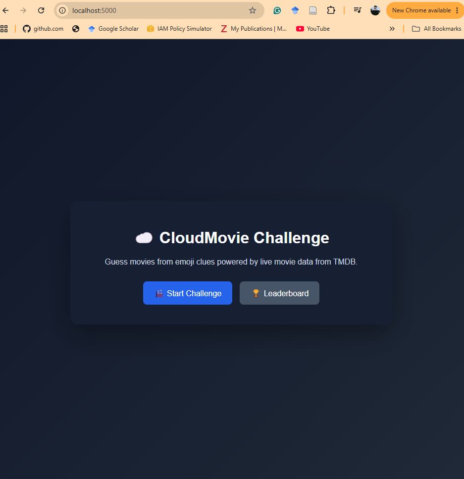
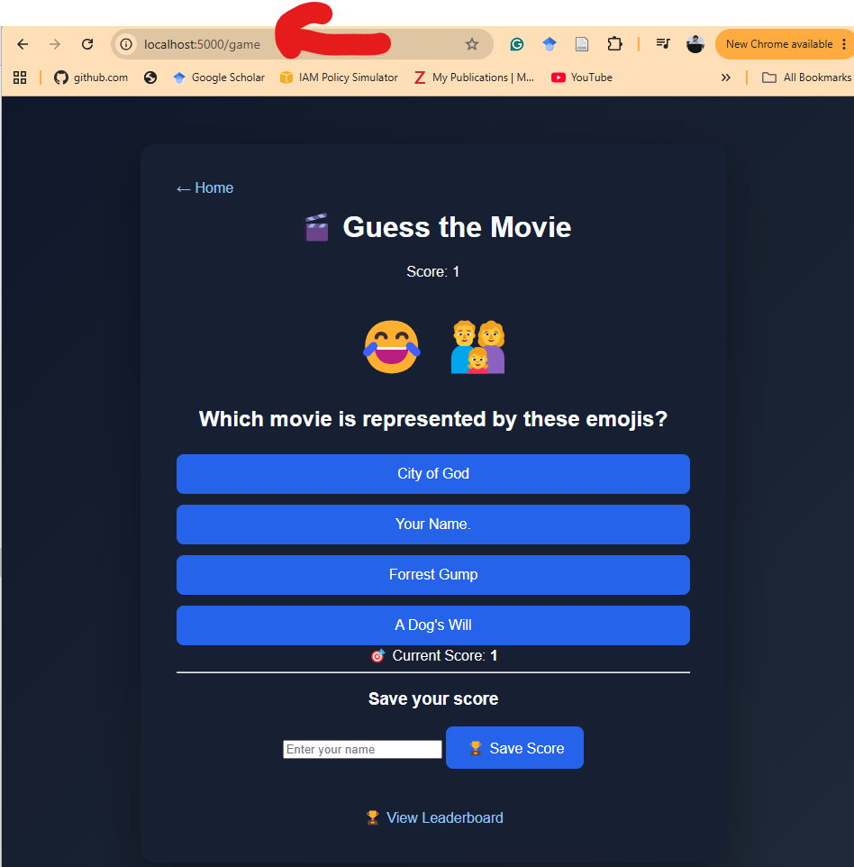

# CloudMovie Challenge - Complete SOLUTION

## Project Overview

CloudMovie Challenge is a cloud engineering capstone project that deploys a movie-guessing web application on AWS using a production-oriented architecture.

The application provides: 

- Emoji-based movie challenges
- Interactive gameplay
- Leaderboard functionality
- Persistent score storage using Amazon DynamoDB

---

# Part 1 - Core AWS Infrastructure and Application Deployment

## 1. Solution Summary

Implemented AWS components:

- VPC
- Public and private subnets
- Route tables
- Internet Gateway
- Elastic IP
- NAT Gateway
- Security Groups
- EC2
- Application Load Balancer
- Target Group
- DynamoDB

---

# 2. Application Screens

## Home Page

Image path:

`docs/screenshots/01-application-home-page.png`

The home page introduces the CloudMovie Challenge and provides entry
points to start the game or open the leaderboard.

## Game Page

Image path:

`docs/screenshots/02-application-game-page.png`

The game page displays emoji clues, multiple-choice answers, the current
score, and an option to save the score.

## Leaderboard Page

Image path:

`docs/screenshots/03-application-leaderboard-page.png`

The leaderboard displays stored scores and confirms integration with
Amazon DynamoDB.

---

# 3. Networking Layer (AWS VPC)

The application uses a production-style VPC architecture with separation
between public and private resources.

Evidence:

    

docs/screenshots/04-vpc-dashboard-resources-by-region.png

    docs/screenshots/05-vpc-resource-map.png

    docs/screenshots/06-subnets.png

    docs/screenshots/07-route-tables.png

    docs/screenshots/08-internet-gateway.png

    docs/screenshots/09-elastic-ip-addresses.png

    docs/screenshots/10-nat-gateway.png

    docs/screenshots/11-security-groups.png

Architecture includes:

- Four subnets across two Availability Zones
- Public subnets for internet-facing resources
- Private subnets for application resources
- NAT Gateway for outbound private traffic
- Security Groups for access control

---

# 4. Compute and Load Balancing Layer

## EC2

The application is hosted on Amazon EC2.

Evidence:

    docs/screenshots/12-ec2-dashboard.png

    docs/screenshots/13-ec2-instances-overview.png

    docs/screenshots/14-ec2-instance-details.png

    docs/screenshots/15-ec2-running-instance-private-network.png

The running instance is deployed inside the private network and accessed
through the Application Load Balancer.

## Application Load Balancer

Evidence:

    docs/screenshots/16-application-load-balancer.png

    docs/screenshots/17-target-group.png

The ALB provides:

- Internet-facing access
- Traffic distribution
- Target health monitoring
- Availability Zone support

---

# 5. Data Layer - Amazon DynamoDB

Leaderboard storage is implemented using DynamoDB.

Table:

`cloudmovie-challenge-dev-leaderboard`

Configuration:

- Partition key: player_id
- Status: Active
- Encryption enabled

Evidence:

    docs/screenshots/18-dynamodb-table-overview.png

    docs/screenshots/19-dynamodb-table-details-tags-encryption.png

    docs/screenshots/20-dynamodb-leaderboard-items.png

---

# Part 2 - Monitoring, Serverless Features and CI/CD

## 6. AWS Lambda Serverless Feature

A stateless AWS Lambda function was added as a bonus challenge.

Purpose:

- Generate bonus movie challenges
- Demonstrate serverless architecture
- Produce CloudWatch logs

Evidence:

    docs/screenshots/21-tmdb-api-secret-exists-2.png

    docs/screenshots/22-lembda-stateless-function-2.png

---

# 7. Secrets Management

AWS Secrets Manager is used to securely store:

- TMDB API credentials
- Application secrets

Benefits:

- Improved security
- Centralized secret management
- Easier production rotation

---

# 8. CloudWatch Monitoring

CloudWatch provides operational visibility across:

- Application Load Balancer
- Lambda
- DynamoDB
- Logs
- Target health

Evidence:

    docs/screenshots/23-cloudwatch-dashboards-app-aws-console-0.png

    docs/screenshots/24-finops-and-operations-dashboard-couldwatch.png

    docs/screenshots/25-cloudwatch-custom-metrics-1.png

---

# 9. CloudWatch Logs

Lambda execution logs are captured in CloudWatch.

Evidence:

    docs/screenshots/26-cloudwatch-log-groups-2.png

    docs/screenshots/27-cloudwatch-log-stream-3.png

    docs/screenshots/28-cloudwatch-log-event-4.png

    docs/screenshots/29-cloudwatch-log-insight-demo-0.png

---

# 10. CloudWatch Alarms and SNS Notifications

Monitoring alerts were implemented using:

CloudWatch Alarm
↓
Amazon SNS Topic
↓
Email Subscription

Configured alarms:

- Healthy Target Alarm
- HTTP 5xx Error Alarm

Evidence:

    docs/screenshots/30-cloudwatch-alarms-5.png

    docs/screenshots/31-cloudwatch-alarms-6.png

    docs/screenshots/32-sns-cloudwatch-email-subscription-1.png

    docs/screenshots/33-alaram-state-sns-cloudwatch-email-subscription-2.png

    docs/screenshots/34-ok-state-sns-cloudwatch-email-subscription-3.png

---

# 11. GitHub Actions CI/CD

Implemented workflows:

## Infrastructure CI

Responsibilities:

- Terraform formatting check
- Terraform validation
- Infrastructure quality checks

Evidence:

   docs/screenshots/35-cicd-githubaction-infrastructure-ci-workflow.png

## Application Deployment CD

Responsibilities:

- Automated deployment workflow
- Repeatable releases
- Reduced manual errors

Evidence:

    docs/screenshots/36-cicd-githubaction-deploy-cd-workflow.png

---

# Part 3 - Containerisation, ECR and Security Controls

# 12. Terraform Remote State Management

A dedicated S3 bucket was created for Terraform remote state.

Bucket:

`cloudmovie-challenge-tfstate-203637464233-eu-central-1`

Benefits:

- Centralized Terraform state
- Better collaboration
- Persistent infrastructure tracking

Evidence:

    33-s3-bucket-aws-console-tfstate-1(3).png

    34-s3-bucket-aws-console-tfstate-2(2).png

---

# 13. Docker Image Build and Validation

The application was containerized successfully.

Local image:

`cloudmovie-local:latest`

Evidence:

    35-docker-destop-image-0(1).png

    36-docker-destop-container-1(1).png

Container validation:

- Port mapping: 5000:5000
- Status: Running

---

# 14. GitHub Repository Security

Repository secrets configured:

- AWS_ACCESS_KEY_ID
- AWS_SECRET_ACCESS_KEY
- ECR_URL

Evidence:

    38-github-secrets-and-variable-management(3).png

Branch protection was implemented for:

`main`

Evidence:

    37-branch-protection-implemented-at-github(3).png

---

# 15. Amazon ECR Private Repository

Repository:

`cloudmovie-challenge-dev`

Region:

`eu-central-1`

Purpose:

- Secure Docker image storage
- Container deployment integration
- Image version management

Evidence:

    39-amazon-ecr-private-registry-repositories-0(3).png

---

# 16. Container Image Push to ECR

Image:

`cloudmovie-challenge-dev:latest`

Status:

- Active
- Approximately 70 MB

Evidence:

    40-amazon-ecr-private-registry-repositories-cloudmovie-challenge-dev-latest-images-1(3).png

---

# 17. ECR Vulnerability Scanning

Scan results:

  Severity          Count

---

  Critical              6
  High                  9
  Medium                3
  Low                   1
  Informational         0

Evidence:

    41-amazon-ecr-private-registry-repositories-security-vulnerabilities-2(2).png

Recommended improvements:

- Update base images
- Remove unnecessary packages
- Use hardened images
- Integrate automated scanning into CI/CD

---

# 18. Final Architecture Summary

  Area               Implementation

---

  Infrastructure     Terraform
  Networking         VPC, Subnets, IGW, NAT Gateway
  Compute            EC2
  Load Balancing     Application Load Balancer
  Database           DynamoDB
  Serverless         AWS Lambda
  Storage            Amazon S3
  Secrets            AWS Secrets Manager
  Containerisation   Docker
  Registry           Amazon ECR
  Monitoring         CloudWatch
  Alerting           SNS
  Automation         GitHub Actions

---

# Conclusion

The CloudMovie Challenge demonstrates a complete cloud engineering
workflow covering:

- Infrastructure as Code
- AWS networking
- Application deployment
- Database integration
- Serverless architecture
- Secure secrets handling
- Containerisation
- Container security scanning
- Monitoring and alerting
- CI/CD automation

The project represents a production-oriented AWS cloud engineering
implementation suitable as a portfolio capstone project.
